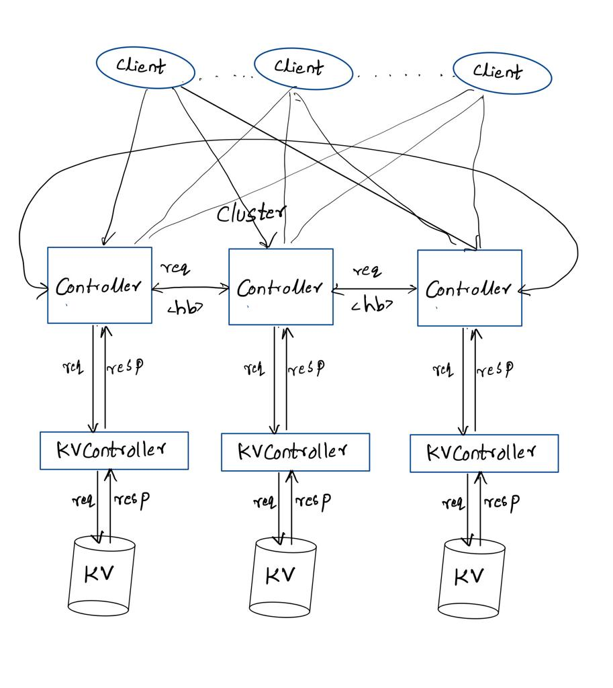
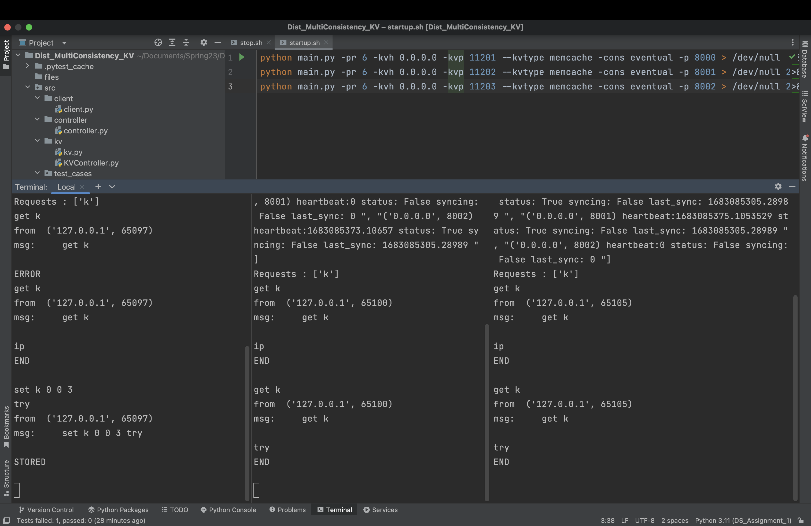
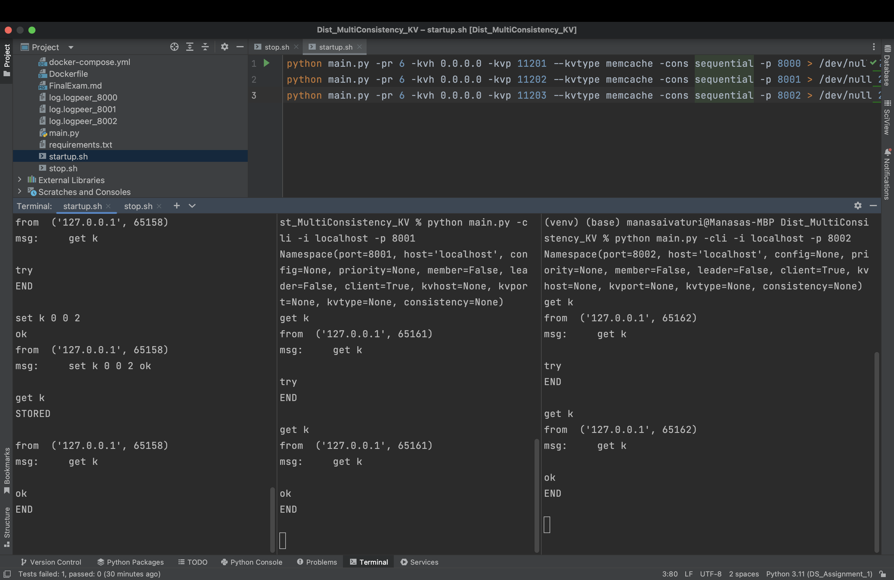
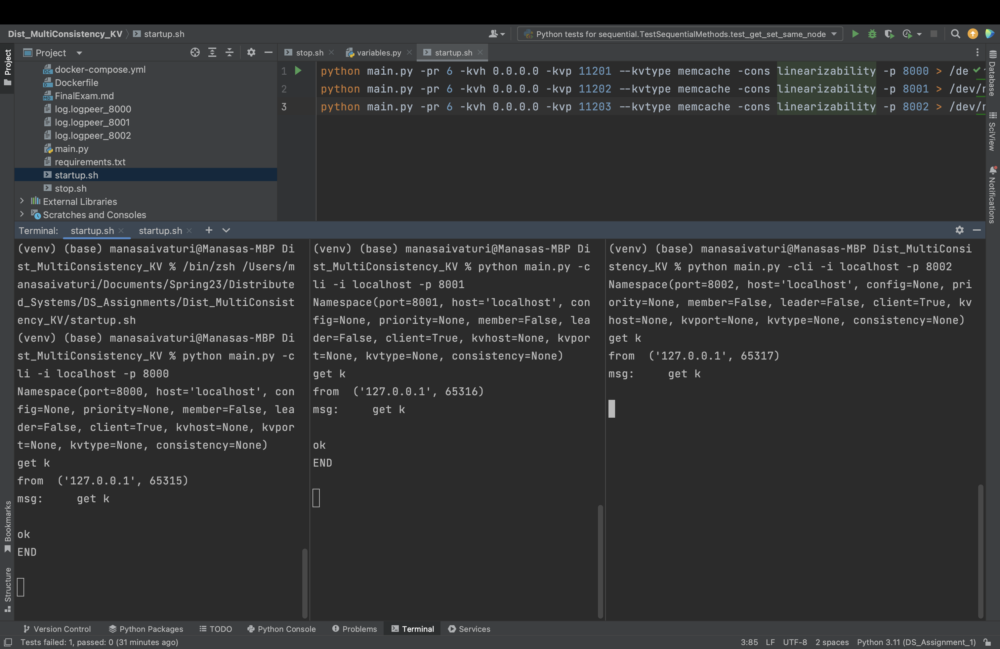
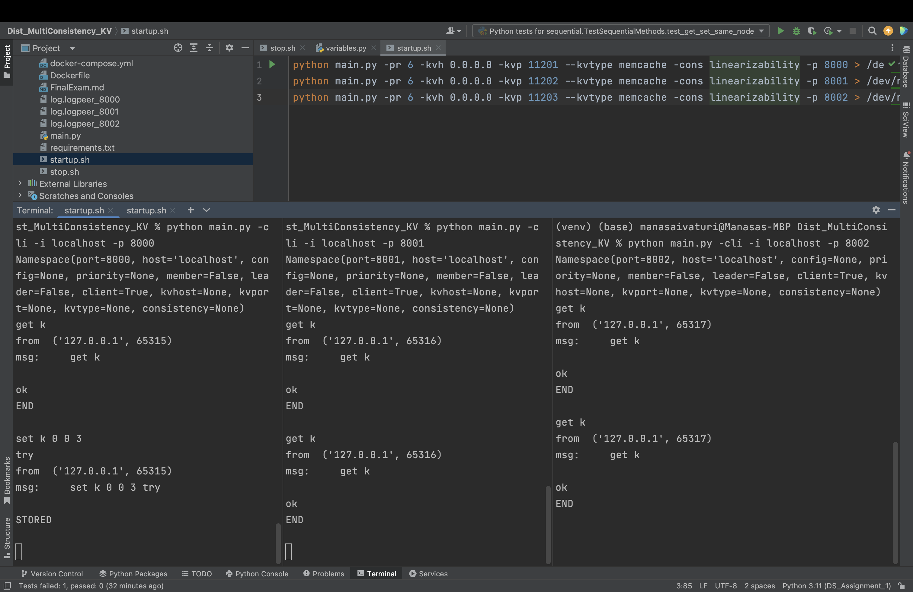

# Distributed multi consistency Key-Value store

### Contents
- About Project
	- Folder Structure
	- How to set up and run
	- Class Diagram/Architecture
- Design Principles
- Design Detail
- Consistency
  - Linearizability
  - Sequential Consistency
  - Eventual Consistency
- Testing
- Compatibility
- Limitations
- Future Scope


### About Project
In order to build this project from scratch, we have leveraged the Python inbuilt libraries and various modules inside this.

In a brief, this project uses socketserver to enable peer-peer communication.

The project architecture goes as follows:
- A Controller-Cluster exists on the top level.
  - This cluster contains `3` controllers.
  - Each peer of the cluster is provided with the address of all the other peers.
  - The peers can communicate with each other.
  - Peers will notify their status to other peers through heartbeat 
  - The Cluster can be customised with the type of kv_store to use and the consistency to use at the time of creation.
  - The Cluster behaviour depends on the consistency set.
- Controller
  - The Controller is on the top level of this project.
  - It is responsible for the communication with clients.
  - Each Controller acts as a peer.
  - The controller communicates with kv_controller for with the requests received from the client.
- KV_Controller
  - The KV_Controller acts as an interface between the Controller(peer) and the KV Store.
  - The KV_Controller upon receiving a request from the controller sends the request to the specified kv_store and sends back the response to the Controller(peer).
  - With modifications the KV_Controller can act as interface between controller any kind of kv_store.
- KV_Store
  - The kv store sits at the bottom level of this architecture.
  - And is responsible for processing the get/set requests directed to it.

#### Folder Structure
For the ease of development and debugging, we have tried to follow the principle of "Separation of Concerns" and the folder structure of this project echoes the same. All the files/folders in the project image are explained underneath.


Explanation -
- The driver-code for this project **main.py** stands at the project root and is responsible for all operations, in general.  
  - This is responsible for spawning up the controllers and the cluster with the specific configurations passed as arguments.

- All the critical source-code has been placed in the **src** directory, followed by the config file available on the project root.
  - **KVController.py** acts as a logical interface between the controllers and kv_stores.
  - The **Client.py** provides the client interface which can be used to communicate with any peer of the cluster using the address of the specific peer.
  - The **Controller.py** is the key component for this system.
- -
- The config file(**config.ini**) has critical configuration information like server bind addresses and ports for the controller-cluster, heartbeat time and is passed as an argument at the time of the cluster creation.

- The logs generated are present in the root.

- Tests for this project are placed in the **test_cases** folder.

- As we may require additional libraries, these are placed in the **requirements.txt** file which can be used to install dependencies.


#### How to set up and run

To start the cluster with default configs - assuming availability of network ports(8000,8001,8002,11201,11202,11203) and `Docker`, here are some steps -
- run `docker-compose up -d`
- change the `-cons` variable in the `startup.sh`
- run the startup.sh script
- connect to the client and run commands!


This project runs on python 3.11 because of this version's efficiency, however, since all the code leverages same libraries which do not have a higher-level changes since python3.7, so we assume that it should work with python 3.7 and above, however, this is yet to be tested.

Assuming that python 3.11 is installed, we proceed with installing dependencies -

```sh
pip3 install -r requirements.txt
```

If the dependencies are installed fine, to initialize the server, we assume that the right permissions exist for the server to write files to data directory as given in the config file.

Also, 
To start Controller with a kv_store -
```sh
python3 main.py -c <config_file> -h <host> -p <port> -kvh <kv_store_host> -kvp <kv_store_port> -kv <kv_store_type> -cons <consistency>
```
The host and port for the peer and are defined in the config.ini, which is shared for among all the peers.
The kv_store_host and kv_store_port are the host and port for the kv store that is desired to be used.
The kv_type is to specify the key value store to be used. By default, the system runs on memcache.
The config_file provides the default configuration and is a necessity for the functioning of the cluster.
If no config_file path is provided the system runs with default config file provided.
The consistency type can be given with consistency argument **-cons** as any of the following list. 
- [linearizability, sequential, eventual]


To Start the Client:
```sh
python3 main.py -cli -i <host of controller> -p <port of controller>
```
The **-cli** flag is responsible for creating the client.
The desired server address to be connected must be given when creating the client.

The cluster can be started with `startup.sh` file and closed using the `stop.sh`.

The cluster consistency can be set in the `startup.sh`.

Example -

to start the controller -
```shell
python main.py -pr 6 -kvh 0.0.0.0 -kvp 11201 --kvtype memcache -cons linearizability -p 8001 > /dev/null 2>&1 &
```
to start the client - 
```shell
python main.py -cli -i localhost -p <Port of controller 8001>
```

The kv store can be started using the docker compose file.
The replicas are started on the ports 11201, 11202 and 11203.

The controllers are started from the ports 8000, 8001 and 8002 specified in the config file.

To validate the cluster startup - `show` command can be used to see the current status of the cluster and requests

#### Class Diagram

Please refer to the below image for class diagram/architecture from a high-level.

Please note that the KV-CONTROLLER in the diagram below is a logical layer in the `Controller`.



### Design principles
While writing code is an important aspect, we intend to make this application with 3 major principles in mind -

- Easy to debug
- Fault-tolerance
- Separation of Concerns
 
Also, we intend to build an application that follows the 12-factor-app principles (as applicable) like - configurability, scalability, etc.

### Design details:

The Controller-Cluster consists of `3` Controllers acting as peers and falls under peer-peer architecture.

As soon as a peer is spawned up:
- The peer gets the addresses of the other peers in the cluster from the **config.ini** file.
- The consistency provided during creation is set here.
- With the kv_store address provided, the peer establishes a connection with the kv_store.
- It checks if the other peers are up and active and establishes communication with them.
- The peer tries to sync up it's key-value store replica with the other replicas.
- It communicates  its status with the other peers through heartbeat.
- The peer also checks the status of other peers and updates their status as `True` or `False` in its local memory.
- The peer is available to the client for requests.
- The client requests are processed through the KVController.
- Based on the consistency each request is processed.

KVController:
- The KVController acts as an interface between the Controller and the KV_Store.
- As soon as the Controller(peer) spawns up and instance of the KVController is created.
- The KVController is provided with the type of the KV_Store being used and the address of the KV_Store at the time of instantiation.
- The KVController establishes the connection with the KV_Store.
- Henceforth, the requests are communicated to the KV_Store from the Controller through the KVController.
- The responses are returned to the Controller.


### Consistency

This system provides 3 types of consistencies. The type of consistency is set at the time of the cluster creation.

#### Linearizability

Linearizability is a strict consistency.

To achieve linearizability the system works in the following way.
- A check_requests is thread is started which is responsible for constantly monitoring the requests that are to be fulfilled.
- When a new request arrives at the Controller-Peer it is pushed into the Custom_request_queue.
  - There exists 2 types of request **direct** and **indirect**.
  - The direct requests are the requests from the client to the controller.
  - The indirect requests are the requests from the other Controllers or Peers.
- Each get from the Custom_request_queue provides the oldest request or the request with the lowest timestamp.
- The check_requests method gets the request from the queue.

Journey of a Request:
- A direct request(from the client) arrives at the controller.
- A request object is created with the timestamp of the request arrival.
- This request object is pushed into the Custom_request_queue.
- In the Check_requests thread, the request is taken.
  - If the request type is direct:
    - The request is sent to the other peers.
    - The control waits for all the peers to agree for processing this request.
    - Once all the peers agree, the request is sent to the kv_store through KVController.
    - When the request is processed, the status of the request is set to `True` as fulfilled and the response is stored to the request object, ready to send to the client.
    - The response of the request is sent to the client and the request is removed from Custom_request_queue and added to the completed requests.
- In case of an indirect request(from other controllers)
  - The request is put into the Custom_request_queue.
  - The acceptance is sent to the Controller which sent the request.
  - In the Check_requests thread, the request is taken.
  - Since it is an indirect request, it is processed as is.(since, no further acks are required)
  - The response is not stored or sent.
  - The request is popped from the Custom_request_queue and added to the completed_requests.

#### Sequential Consistency

Sequential Consistency is a relatively looser consistency in comparison with linearizability.

The sequential consistency uses the local read and does not wait for the indirect messages to complete before processing the Current request.

To achieve Sequential Consistency the system works in the following way:
- A check_requests is thread is started which is responsible for constantly monitoring the requests that are to be fulfilled.
- When a new request when it is a `set` arrives at the Controller-Peer it is pushed into the Custom_request_queue.
  - There exists 2 types of request **direct** and **indirect**.
  - The direct requests are the requests from the client to the controller.
  - The indirect requests are the requests from the other Controllers or Peers.
- Each get from the Custom_request_queue provides the oldest request or the request with the lowest timestamp.
- The check_requests method gets the request from the queue.
- If the request is a `get` operation the request is processed or executed and the response is sent back to the client without any further ado.

Journey of a Request:
- A direct request(from the client) arrives at the controller.
- A request object is created with the timestamp of the request arrival.
- This request object is pushed into the Custom_request_queue if it is a `set` request.
- In the Check_requests thread, the request is taken.
  - If the request type is direct:
    - The request is sent to the other peers.
    - The control waits for all the peers to agree for processing this request.
    - Once all the peers agree, the request is sent to the kv_store through KVController.
    - When the request is processed, the status of the request is set to `True` as fulfilled and the response is stored to the request object, ready to send to the client.
    - The response of the request is sent to the client and the request is removed from Custom_request_queue and added to the completed requests.
- In case of an indirect request(from other controllers)
  - The request is put into the Custom_request_queue.
  - The acceptance is sent to the Controller which sent the request.
  - In the Check_requests thread, the request is taken.
  - Since it is an indirect request, it is processed as is.(since, no further acks are required)
  - The response is not stored or sent.
  - The request is popped from the Custom_request_queue and added to the completed_requests.


#### Eventual Consistency

Eventual Consistency is considered to be a relatively looser consistency.

To achieve Eventual Consistency the system works in the following way:
- There is no Check_requests thread and Custom_requests_queue for the implementation of the Eventual Consistency.
- Alongside the heartbeat sync requests are called periodically.
- Each peer requests to sync with the other peers.
- Each peer responds to the sync request with the local completed_requests.

Journey of a Request:
- When the peer gets a request, it processes the request.
- Sends the response to the client.
- And adds the request to the completed_requests along with timestamp.

Sync with other peers:
- Each peer requests a sync to the all other peers.
- The protocol is as follows
  ```sh
  sync request <host> <port> <last_sync time>
  ```
    - The provides its address and the latest timestamp until which the peer is in sync with the specified peer.
- Once a sync request is sent to a peer, the sender marks the syncing as `True` (in progress) with that peer and will not send further syncs requests until the current sync is complete.
- The peer receives sync responses with the requests it has to update from the given timestamp.
  - The peer(sender) processes these requests and adds them to the completed requests.
  - If the timestamp of a specific request with a key is greater than the timestamp of the key in the peer's local completed requests, Only then the new request processed.
  - Thus, the peer maintains the latest value of each request.
  - The sync process ends with a `complete` in the sync response.
  - The peer will update the last_sync time with this peer.
  - With this `complete` the peer(sync request sender) marks the sync with that peer as complete and sets syncing to `False`.

- When a peer gets a sync request:
  - It checks the timestamp in the message.
  - Based on the timestamp(last_sync time) it prepares the messages to be sent from the completed_requests.
  - The protocol for this is:
   ```sh
  sync response <host> <port> <timestamp> <key> <msg_req>
  ```
    - The peer sends all the latest updates (set requests) to the peer(requester) using the above protocol.
  - Once all the update messages are sent, the peer responds with a final `complete` response to the peer(requester) to notify it that is in sync.
  - The protocol for the final `complete` response is as follows:
   ```sh
  sync response <host> <port> <timestamp> complete
  ```
- This ends the sync process.
The syncs are performed periodically.


#### Fault Tolerance:

The peers in the cluster can handle fault tolerance of a peer breaking away and allow for reconnecting.
The peer is not removed from the cluster group but rather marked as false. 
When a peer is up again and sends a heartbeat other peers marks its status as active.

#### Testing

For each kind of consistency model, we have tried to test the following -
- `get` and `set` operations on same node
- `get` and `set` operations on different nodes

Below are the screenshots of tests in different consistency modes -

Eventual
- 

Sequential
- 

Lineraizability
- 

- 

### Compatibility

Since our server is compliant with the memcache protocol it is thus innately compatible with any memcache compatible KV store.

The same has been thoroughly tested.

### Limitations
- Keyboard interrupts and sudden disconnections are not yet handled.

### Future Scope
- Updating the system to provide for `Causal Consistency`
- Updating the system to work with different type of KV_Stores.
- Improving persistence.
- Handling system interrupts.
